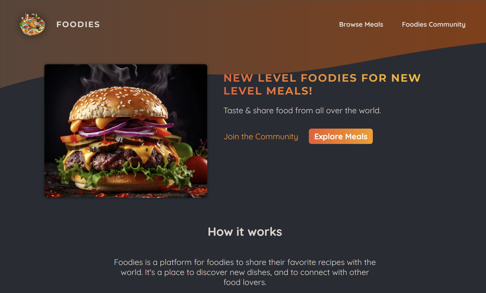
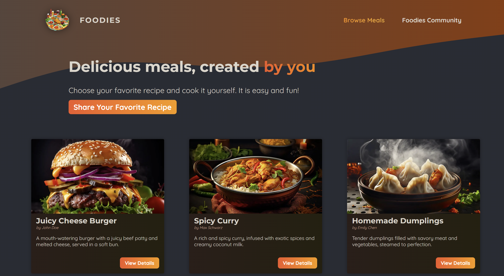
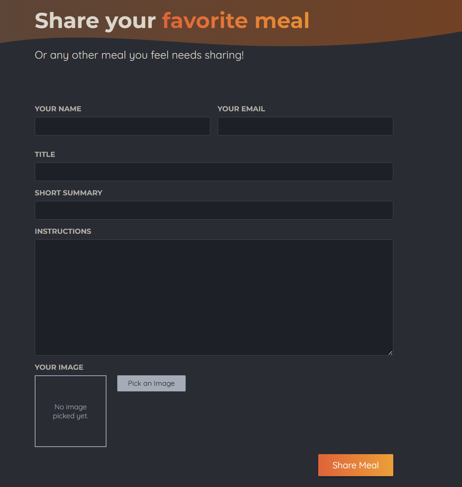

# Foodies

Welcome to Foodies! This is a Next.js application with a SQLite database backend.

## Setup

Follow these steps to set up the project locally:

1. **Clone the repository:**
   ```sh
   git clone https://github.com/JamieDeveloper/foodies.git
   cd foodies
   ```

2. **Install dependencies:**
   ```sh
   npm install
   ```

3. **Initialize the database:**
   ```sh
   node initdb.js
   ```

4. **Run the development server:**
   ```sh
   npm run dev
   ```

5. **Open the app in your browser:**
   Navigate to [http://localhost:3000](http://localhost:3000).

## Pages

### Homepage


### Meals Page


### Share Page

